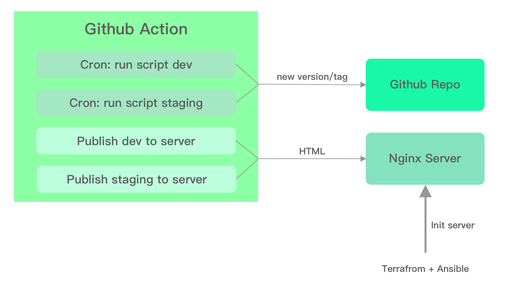

# Wiredcraft DevOps - Interview Task

Demo:

- dev: [dev.joway.io](https://dev.joway.io/)
- staging: [staging.joway.io](https://staging.joway.io/)

## Requirements

- Terraform
- Ansible
- Hugo
- Makefile
- DigtalOcean

## Design



1. Create a server with terraform, and install required packages by ansible.
2. Use Github Action to create new post and new tag periodically.
3. Use Github Action to deploy the latest commit or tag to nginx server.

Hugo will consume large cpu resources when building a new site which could make the production environment unstable. And install too many build tools like ansible/terraform in the server will make the environment complicated and unsafe.

In our architecture design, we only use our server to serve static html files with Nginx. Github Action will do the rest things like building website, create cronjobs and push back to github.

## Getting Started

Notes: Since DigtalOcean's network will be disturbed by [GFW](https://en.wikipedia.org/wiki/Great_Firewall), maybe you need to prepare a VPN first.

### Prepare

#### Set digtalocean token

[How to Create a Personal Access Token](https://www.digitalocean.com/docs/apis-clis/api/create-personal-access-token/)

```sh
export DO_TOKEN=bbxxxxxx
```

#### Create ssh key and add them into DigtalOcean

```sh
# the key files will be saved as ./id_rsa and ./id_rsa.pub
make create-ssh-key
```

#### Init environment(terraform)

```sh
make init
```

### Create server

```sh
make create-server
```

You could find your server IP in file `./ansible/inventory.cfg`, and the ssh-key is `./id_rsa` which you have created in the prepare step.

### Run dev script

```sh
make upgrade-dev
```

### Run staging script

```sh
make upgrade-staging
```

### Prepare Github Secrets

Create secrets in github:

- SERVER_IP: Your nginx server ip
- SSH_KEY: Your `id_rsa` file content
