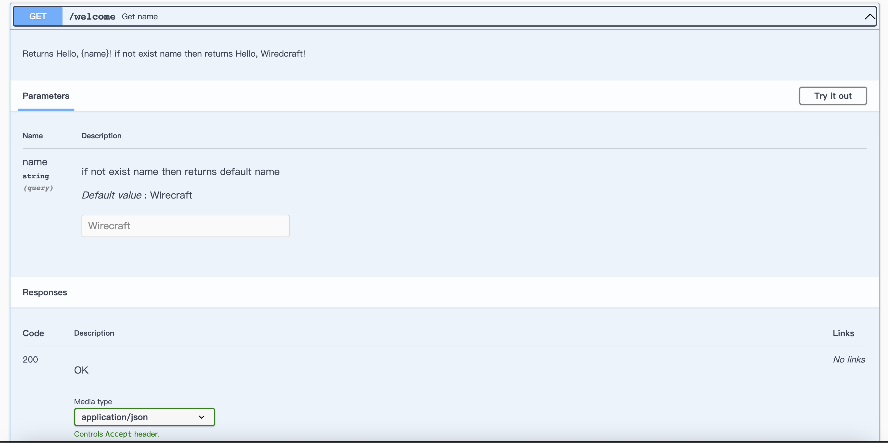
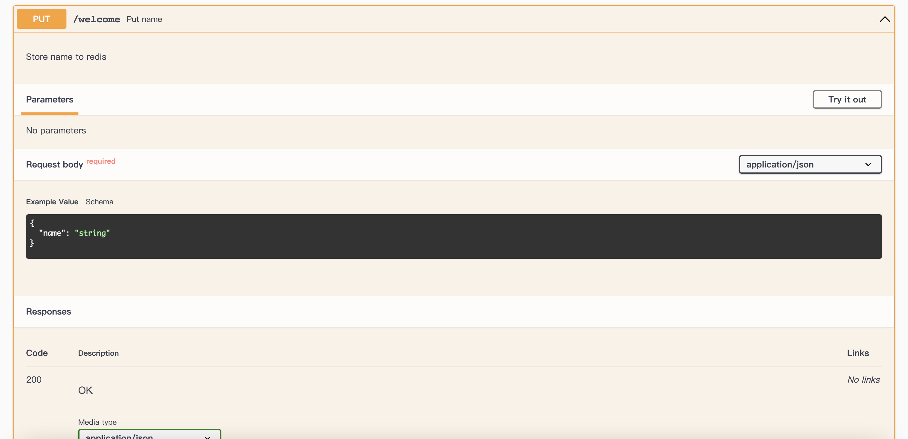

### Test4 API
```shell
# build
docker build . -t daryl-api:1.0

# run
docker run -p 5000:5000 -d daryl-api:1.0
```
| env            | default value | reuqired |
| -------------- | ------------- | -------- |
| FLASK_RUN_HOST | 0.0.0.0       | true     |
| REDIS_HOST     | 192.168.1.137 | true     |

### API Spec

/openapi/swagger

### Get Name
GET /welcome



### Put Name
PUT /welcome




